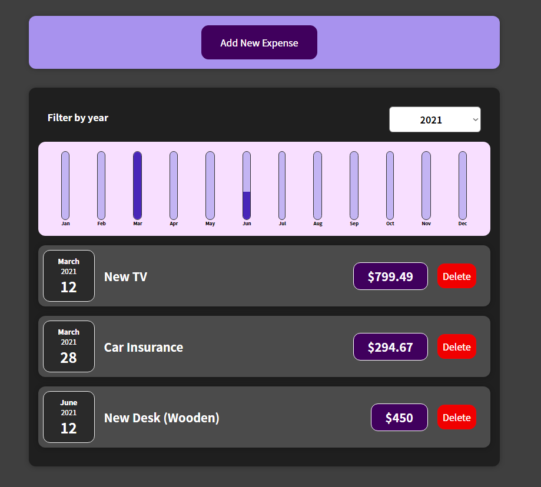

# React Expense Tracker

This app allows you to create a list of Expenses, you can add your expenses from the year 2019 to 2022.
It also displays a chart that shows a percentage representing much money you have spent per month.

## Adding a new expense

Click the add new expense button to get a form that will let you add a new expense, remember to fill all the fields, otherwise the app will alert you and it won't create the new expense.

## Deleting an expense

Click on the delete button to delete the expense.

